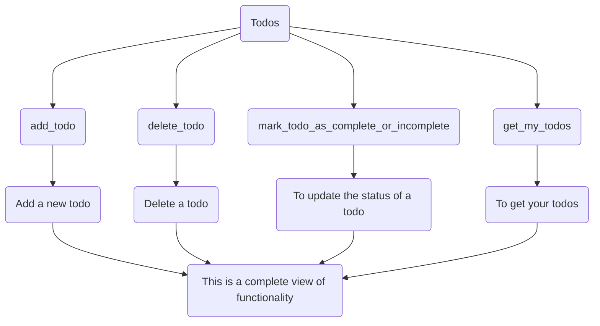

# Near Todo App
The near todo app is a sample project using Near Protocol. Its a simple project that allows users to add new todos, update todo status, delete todos and get all their todos.

## Required Software
- Rust + cargo
- Node + npm
- NEAR CLI 3.1

## Chart of functions
 - This chart shows the functions and what they do.

## Quick near calls from the terminal
> **Remember you should be logged in to near from your terminal before you make the calls.**
 1. **To add a new todo** -  `near call dalmasonto.testnet add_todo '{"title": "some todo value"}' --accountId youraccount.testnet`
 2.  **To get all your todos** - `near call dalmasonto.testnet get_my_todos --accountId youraccount.testnet`
 3.  **To mark todo as complete or incomplete** - `near call dalmasonto.testnet mark_todo_as_complete_or_incomplete '{"todo_id": <id> }' --accountId youraccount.testnet`
 4.  **To delete a todo** - `near call dalmasonto.testnet delete_todo '{"todo_id": <id> }' --accountId youraccount.testnet`

> **Pro Tip** - Replace `youraccount.testnet` with your ***Testnet account***

> **Don't forget** - `<id>` Should be replaced with the right id of a todo you get after adding a new todo.

## Author
Dalmas Ogembo <dalmasogembo@gmail.com> [@dalmasonto](https://twitter.com/dalmasonto)
Visit site [Live Software Developer](https://livesoftwaredeveloper.com)
